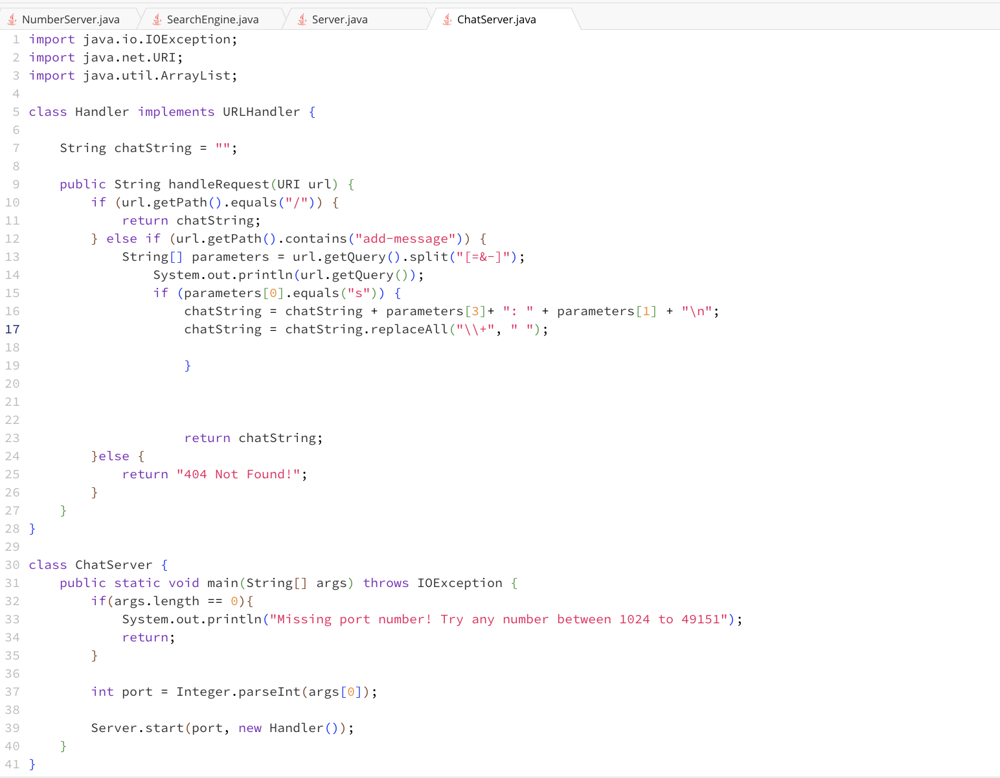
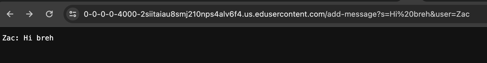
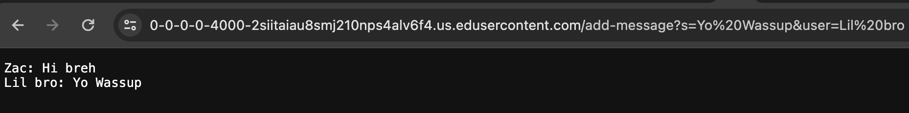
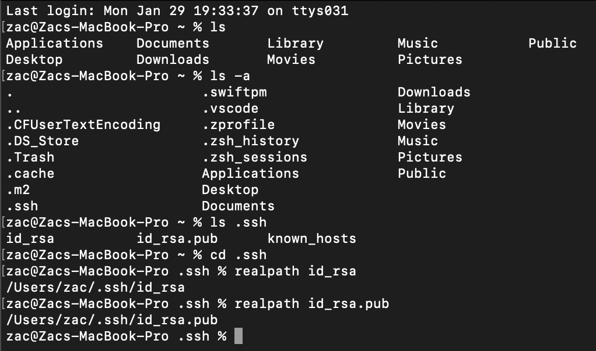
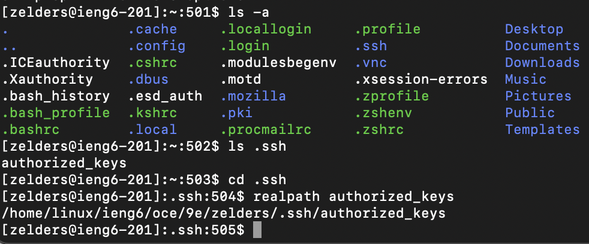
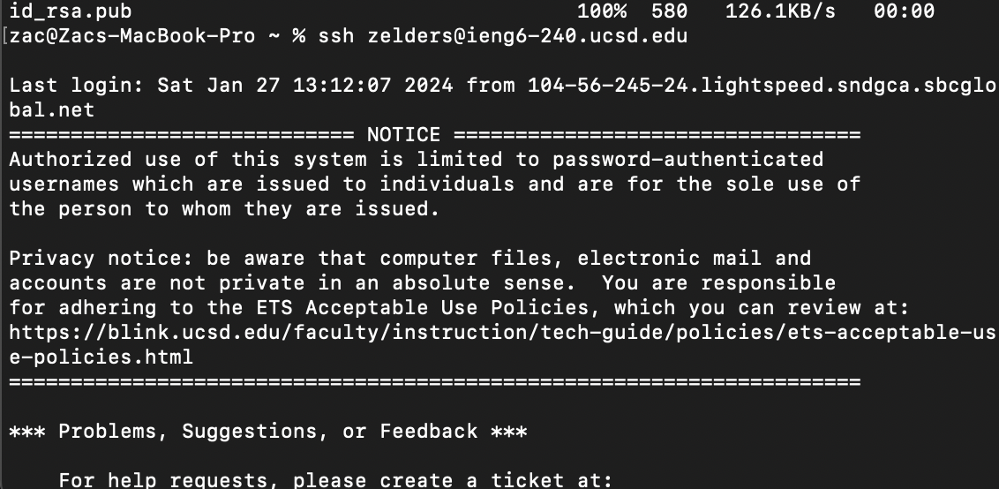

[Index](https://zcashe.github.io/cse15l-lab-reports/index.html)
---
# Lab 2 Report 
---
# Part 1
## Code for Chat Server


## Using add message first time


Methods Called:
1. url.getPath().equals()
2. url.getPath().contains()
3. Url.getQuery().split
4. url.getQuery()
5. chatString.ReplaceAll()


Relevant arguments and field values:

Argument url of type URI, is the url we are changing and loading the page with.

Then we have the empty chatString value, the string array parameters which will contain the split url query.


Which values change:

When we load the new page with out ?s=Hi bruh&user=Zac
the url value is now changed to have that at the end. 

Then parameters is updated to be a string array split at the = and & signs, making it a length 4 array where

Parameters[0] = s

Parameters[1] = Hi bruh

Parameters[2] = user

Parameters[3] = Zac

Then since parameters[0] = s, chatString gets updated
to append "Zac: Hi Bruh" and the new line.

Then because of the url encoding, the space gets turned into +, so we change it back to a space before we display.

## Using add message second time


Methods Called:
1. url.getPath().equals()
2. url.getPath().contains()
3. Url.getQuery().split
4. url.getQuery()


Relevant arguments and field values:

Argument url of type URI, is the url we are changing and loading the page with.

Then we have the empty chatString value, the string array parameters which will contain the split url query.


Which values change:

When we reload the new page with ?s=Yo Wassup&user=Lil bro
the url value is now changed to have that at the end. 

Once again the string array parameters is updated to be a string array split at the = and & signs, making it a length 4 array where

Parameters[0] = s

Parameters[1] = Yo Wassup

Parameters[2] = user

Parameters[3] = Lil bro

Then since parameters[0] = s, chatString gets updated
to append "Lil bro: Yo Wassup" and the new line.


Then because of the url encoding, the spaces gets turned into +, so we change them back to a space before we display.

This gives the update chatString variable "Zac: Hi bruh \n Lil bro: Yo wassup \n" 
Where the \n represents new lines.

We then display this message.


---

# Part 2
---
## Absolute path to private key 
```
/Users/zac/.ssh/id_rsa
```


## Absolute pash to public key from ieng6 file system
```
/home/linux/ieng6/oce/9e/zelders/.ssh/authorized_keys
```
## LS and absolute path to  private key screenshot 

## LS and absolute path to public key screenshot


## SSH in without password


---
# Part 3
## What have I learned in the past 2 weeks?
> Before these last 2 labs, I had no idea that it was possible to generate a public and private ssh key, which I can use to log in without my password. I also learned about how queries work in java and how to run a web server. I think the web servers seem interesting and I want to see what else can be done with them. The concept of URIs and URI handling was new to me as well, however I think I have a good grasp of the concept now that I made my own system to handle changes in URLs.
---
