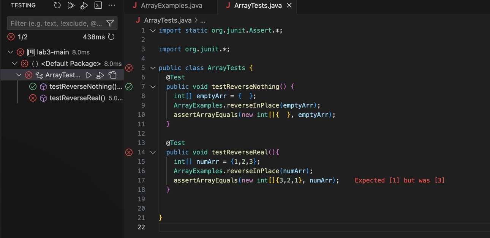

[Index](https://zcashe.github.io/cse15l-lab-reports/index.html)
---
# Lab 3 Report 
---
# Part 1 Bug Testing

## Non-Failing Test:
```
@Test 
public void testReverseOne() {
    int[] singleArr = { 1 };
    ArrayExamples.reverseInPlace(singleArr);
    assertArrayEquals(new int[]{  }, singleArr);
}
```


## Failing Test:
```
@Test
public void testReverseReal(){
    int[] numArr = {1,2,3};
    ArrayExamples.reverseInPlace(numArr);
    assertArrayEquals(new int[]{3,2,1}, numArr);
}
```

## Symptom:


## The Bug:
Before:
```
static void reverseInPlace(int[] arr) {
    for(int i = 0; i < arr.length; i += 1) {
      arr[i] = arr[arr.length - i - 1];
    }
  }
```
After:
```
static void reverseInPlace(int[] arr) {
    int[] temp = new int[arr.length];
    for(int i = 0; i < arr.length; i += 1) {
      temp[i] = arr[arr.length - i - 1];
    }
    for(int i = 0; i< arr.length; i++){
      arr[i] = temp[i];
    }
  }
```
>Explanation: The old code didn't properly iterate through the array, because it changes [0] -> [2] but when it gets to [2] it tries to turn
>it to [0] which is now [2] so [2] -> [2], this is why it doesn't work with the second one but does with the first.
>The new code correctly cycles through and assigns the old values to the reversed order, and then we just assign the values
>to the original array.

---
# Part 2 Exploring find


## Command 1 - find -name
Example 1: find technical/ -name 'preface.*'

Source: [https://man7.org/linux/man-pages/man1/find.1.html](https://man7.org/linux/man-pages/man1/find.1.html)

```
zac@Zacs-MacBook-Pro docsearch % find technical/ -name 'preface.*'
technical//911report/preface.txt
zac@Zacs-MacBook-Pro docsearch % 
```
>Explanation: Here the find -name 'preface.*' finds all files that have preface as the title regardless of the extension.

Example 2: find technical/ -name 'chapter*.txt'

Source: [https://man7.org/linux/man-pages/man1/find.1.html](https://man7.org/linux/man-pages/man1/find.1.html)
```
zac@Zacs-MacBook-Pro docsearch % find technical/ -name 'chapter*.txt'
technical//911report/chapter-13.4.txt
technical//911report/chapter-13.5.txt
technical//911report/chapter-13.1.txt
technical//911report/chapter-13.2.txt
technical//911report/chapter-13.3.txt
technical//911report/chapter-3.txt
technical//911report/chapter-2.txt
technical//911report/chapter-1.txt
technical//911report/chapter-5.txt
technical//911report/chapter-6.txt
technical//911report/chapter-7.txt
technical//911report/chapter-9.txt
technical//911report/chapter-8.txt
technical//911report/chapter-12.txt
technical//911report/chapter-10.txt
technical//911report/chapter-11.txt
zac@Zacs-MacBook-Pro docsearch % 
```
>Explanation: Here the find -name 'chapter*.txt' finds all the textfiles that begin with the word 'chapter' regardless of what comes next.

## Command 2 - find -maxdepth

Example 1: find technical -maxdepth 1 -type d

Source: [https://man7.org/linux/man-pages/man1/find.1.html](https://man7.org/linux/man-pages/man1/find.1.html)
```
zac@Zacs-MacBook-Pro docsearch % find technical -maxdepth 1 -type d
technical
technical/government
technical/plos
technical/biomed
technical/911report
zac@Zacs-MacBook-Pro docsearch % 
```
>Explanation: The maxdepth command here controls how many layers the find searches through. Usually it would go through all directories
>and the subdirectories, but since the maxdepth is 1 it will only go through the current layer.

Example 2: find technical -maxdepth 2 -type d

Source: [https://man7.org/linux/man-pages/man1/find.1.html](https://man7.org/linux/man-pages/man1/find.1.html)
```
zac@Zacs-MacBook-Pro docsearch % find technical -maxdepth 2 -type d               
technical
technical/government
technical/government/About_LSC
technical/government/Env_Prot_Agen
technical/government/Alcohol_Problems
technical/government/Gen_Account_Office
technical/government/Post_Rate_Comm
technical/government/Media
technical/plos
technical/biomed
technical/911report
zac@Zacs-MacBook-Pro docsearch % 
```
>Explanation: The maxdepth is 2 here so it will show all the directories in the technical folder, but since the depth is 2 it will also
>show any directories that are inside the directories shown in maxdepth 1, but will not show any of their subdirectories.

## Command 3 - find -type

Example 1: find technical -type d

Source: [https://man7.org/linux/man-pages/man1/find.1.html](https://man7.org/linux/man-pages/man1/find.1.html)
```
zac@Zacs-MacBook-Pro docsearch % find technical -type d
technical
technical/government
technical/government/About_LSC
technical/government/Env_Prot_Agen
technical/government/Alcohol_Problems
technical/government/Gen_Account_Office
technical/government/Post_Rate_Comm
technical/government/Media
technical/plos
technical/biomed
technical/911report
zac@Zacs-MacBook-Pro docsearch % 
```
>Explanation: The find -type d command here searches technical for all directories, by using the keyword 'd'. 

Example 2: find technical/911report -type f

Source: [https://man7.org/linux/man-pages/man1/find.1.html](https://man7.org/linux/man-pages/man1/find.1.html)
```
zac@Zacs-MacBook-Pro docsearch % find technical/911report -type f
technical/911report/chapter-13.4.txt
technical/911report/chapter-13.5.txt
technical/911report/chapter-13.1.txt
technical/911report/chapter-13.2.txt
technical/911report/chapter-13.3.txt
technical/911report/chapter-3.txt
technical/911report/chapter-2.txt
technical/911report/chapter-1.txt
technical/911report/chapter-5.txt
technical/911report/chapter-6.txt
technical/911report/chapter-7.txt
technical/911report/chapter-9.txt
technical/911report/chapter-8.txt
technical/911report/preface.txt
technical/911report/chapter-12.txt
technical/911report/chapter-10.txt
technical/911report/chapter-11.txt
zac@Zacs-MacBook-Pro docsearch % 
```
>Explanation: The find -type f command here finds alls the elements within 911 report that are files using the keyword 'f'.

## Command 4 - find -size

Example 1: find technical -size +250k

Source: [https://man7.org/linux/man-pages/man1/find.1.html](https://man7.org/linux/man-pages/man1/find.1.html)
```
zac@Zacs-MacBook-Pro docsearch % find technical -size +250k
technical/government/Gen_Account_Office/Statements_Feb28-1997_volume.txt
technical/government/Gen_Account_Office/d01591sp.txt
technical/911report/chapter-13.4.txt
technical/911report/chapter-13.5.txt
technical/911report/chapter-3.txt
zac@Zacs-MacBook-Pro docsearch % 
```
>Explanation: The find -size +250k finds everything that is are greater than 250 kb in size.

Example 2: find technical -size -1k

Source: [https://man7.org/linux/man-pages/man1/find.1.html](https://man7.org/linux/man-pages/man1/find.1.html)
```
zac@Zacs-MacBook-Pro docsearch % find technical -size -1k
technical
technical/government
technical/government/About_LSC
technical/government/Env_Prot_Agen
technical/government/Alcohol_Problems
technical/government/Post_Rate_Comm
technical/plos/pmed.0020191.txt
technical/plos/pmed.0020226.txt
technical/911report
zac@Zacs-MacBook-Pro docsearch % 
```
>Explanation: The find -size -1k finds everything that is less than 1 kb.


