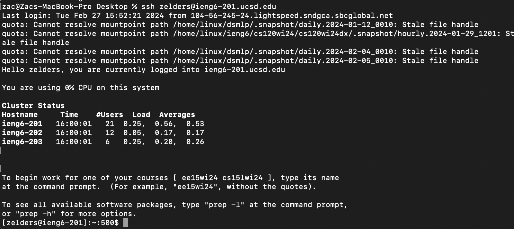
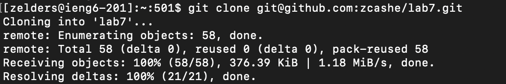
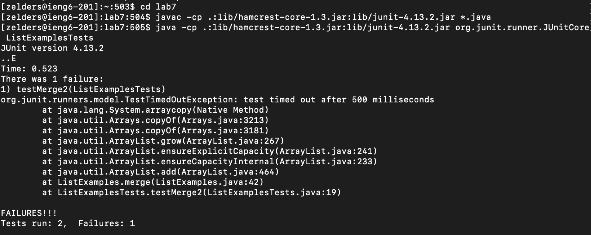
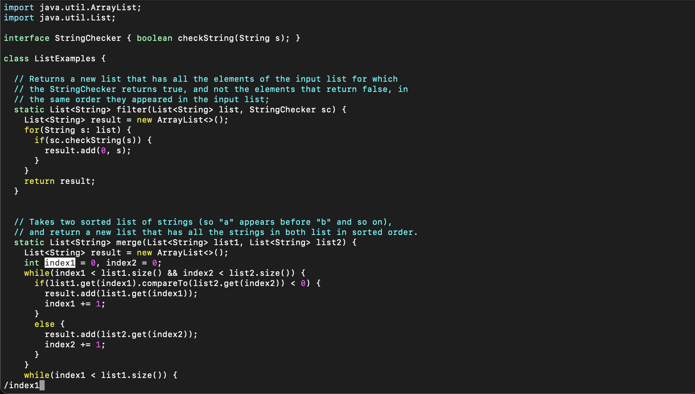
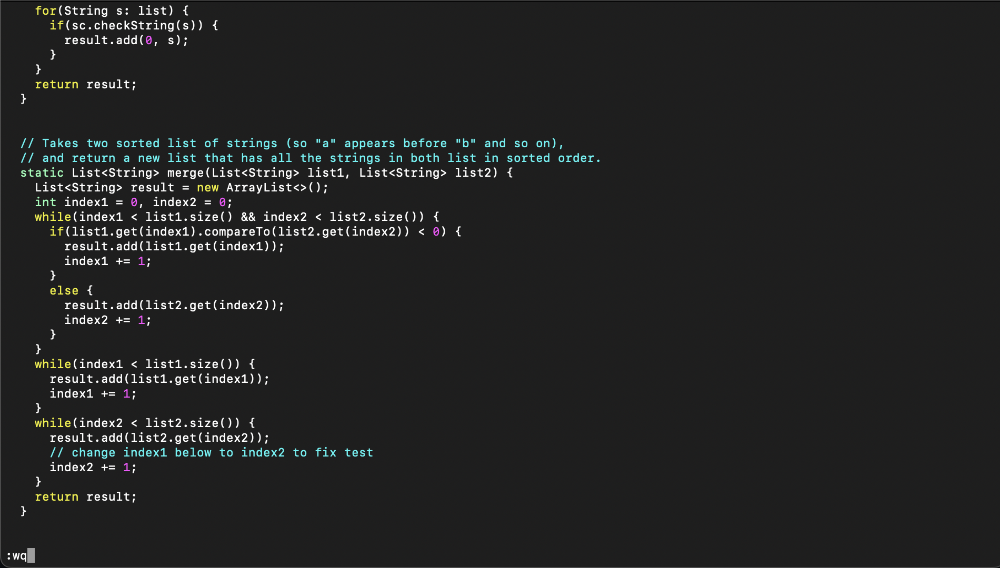
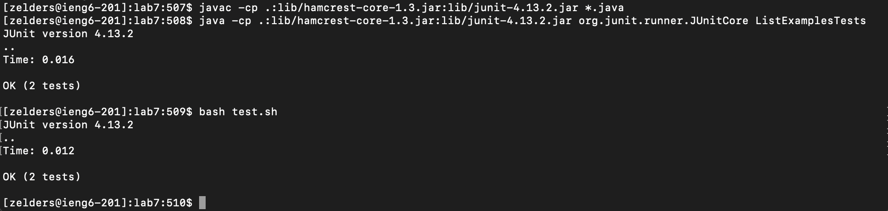

[Index](https://zcashe.github.io/cse15l-lab-reports/index.html)
---
# Lab Report 4 
---
# Part 1 

## Step 4 - Log Into IENG6
``` <up> <enter> ``` The first command in my terminal is ```ssh zelders@ieng6-201.ucsd.edu```



## Step 5 - git clone the forked repository
``` <up> <up> <up> <up> <up> <up> <up> <up> <up> <enter> ``` Once logged into IENG I traverse up 9 times in my history and get to 
```git clone git@github.com:zcashe/lab7.git```


## Step 6 - Run the tests, demonstrating that they fail
``` cd <space> lab7 ``` Change Directory into the lab7 file we just cloned.

``` <command> <shift> v <enter> ``` Here I paste in the ``` javac -cp .:lib/hamcrest-core-1.3.jar:lib/junit-4.13.2.jar *.java ``` in order to 
compile the code.

``` <up> <up> <up> <up> <up> <up> <up> <up> <enter> ``` I traverse up 8 times into my history and get the 
``` java -cp .:lib/hamcrest-core-1.3.jar:lib/junit-4.13.2.jar org.junit.runner.JUnitCore ListExamplesTests ```
which I use to run the tests.


## Step 7 - Edit the code file to fix the failing test
``` vim <space> ListExamples.java``` I use vim to open up the file.
``` /index1 <enter> N ``` I use /index1 to search and then use N to go to the last index1 (since I started at the top)
``` l l l l l x i 2 <esc> :wq ``` Which moves my cursor and then x deltes the 1 in index1 and then i switches
to insert mode and then 2 gets added to index making it index2 and then I esc to exit insert mode, then save and quit with :wq .



## Step 8 - Run the tests, demonstrating that they now succeed
``` <up> <up> <up> <enter> ``` This brings me 3 back into my search history to ``` javac -cp .:lib/hamcrest-core-1.3.jar:lib/junit-4.13.2.jar *.java ``` which I use to compile the new code.

``` <up> <up> <up> <enter> ``` This brings me 3 back into my search history to ``` java -cp .:lib/hamcrest-core-1.3.jar:lib/junit-4.13.2.jar org.junit.runner.JUnitCore ListExamplesTests ``` which I use to run the tests.


``` bash <space> test.sh ``` I use this here just to double check everything matches. This is the same as the two commands above.


## Step 9 - Commit and push the resulting change to your Github account

``` git <space> add <space> ListExamples.java ``` This adds the edited file so I can commit it.
``` git commit -m"Fixed Loop Bug" ``` This commits the changes with a message about what I fixed.
``` git push ``` This pushes the changes to my github account.

