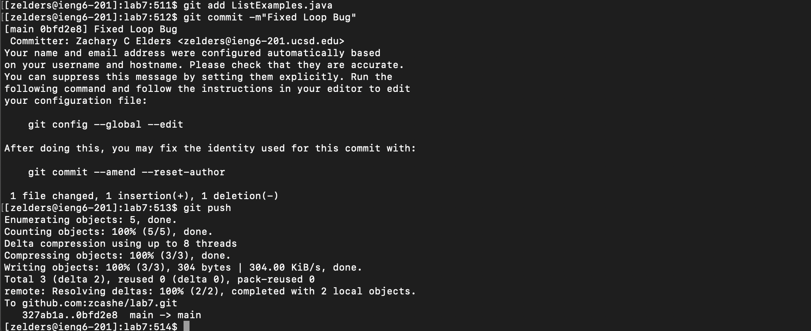

[Index](https://zcashe.github.io/cse15l-lab-reports/index.html)
---
# Lab Report 4 
---
# Part 1 

## Step 4 - Log Into IENG6
Keys Pressed: ``` <up> <enter> ``` 

The first command in my terminal history is ```ssh zelders@ieng6-201.ucsd.edu``` which I use to access IENG6


## Step 5 - git clone the forked repository
Keys Pressed:``` <up> <up> <up> <up> <up> <up> <up> <up> <up> <enter> ``` 

Once logged into IENG I traverse up 9 times in my history and get to 
```git clone git@github.com:zcashe/lab7.git``` which I use to clone the forked repository.


## Step 6 - Run the tests, demonstrating that they fail
Keys Pressed:``` c d <space> l a b 7 ``` 

Change Directory into the lab7 file we just cloned.

Keys Pressed:``` <command+v> <enter> ```

Here I paste in the ``` javac -cp .:lib/hamcrest-core-1.3.jar:lib/junit-4.13.2.jar *.java ``` in order to 
compile the code.

Keys Pressed:``` <up> <up> <up> <up> <up> <up> <up> <up> <enter> ``` 

I traverse up 8 times into my history and get
``` java -cp .:lib/hamcrest-core-1.3.jar:lib/junit-4.13.2.jar org.junit.runner.JUnitCore ListExamplesTests ```
which I use to run the tests.


## Step 7 - Edit the code file to fix the failing test
Keys Pressed:``` v i m  <space> L i s t E x a m p l e s . j a v a ``` 

I use vim to open up the ListExamples file that contains the bug.

Keys Pressed:```  / i n d e x 1 <enter> N ``` 

I use ```/index1``` to search and then use ```N``` to go to the last index1 (since I started at the top)

Keys Pressed:``` l l l l l x i 2 <esc> : w q  ``` 

Which moves my cursor and then ```x``` deletes the 1 in index1 and then ```i``` switches
to insert mode and then 2 gets added to index making it index2 and then I ```<esc>``` to exit insert mode, then save and quit with ```:wq``` .


## Step 8 - Run the tests, demonstrating that they now succeed
Keys Pressed:``` <up> <up> <up> <enter> ``` 

This brings me 3 back into my search history to ``` javac -cp .:lib/hamcrest-core-1.3.jar:lib/junit-4.13.2.jar *.java ``` which I use to compile the new code.

Keys Pressed:``` <up> <up> <up> <enter> ``` 

This brings me 3 back into my search history to ``` java -cp .:lib/hamcrest-core-1.3.jar:lib/junit-4.13.2.jar org.junit.runner.JUnitCore ListExamplesTests ``` which I use to run the tests.


Keys Pressed:``` b a s h <space> t e s t . s h  ``` 

I use this here just to double check everything matches. This is the same as the two commands above.


## Step 9 - Commit and push the resulting change to your Github account

Keys Pressed:``` g i t <space> a d d  <space> L i s t E x a m p l e s . j a v a ``` 

This adds the edited file so I can commit it.

Keys Pressed:``` g i t <space> c o m m i t  <space> - m " F i x e d " ``` 

This commits the changes with a message.

Keys Pressed:``` g i t <space> p u s h ``` 

This pushes the changes to my github account.


